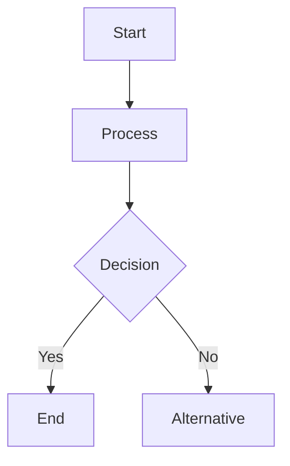
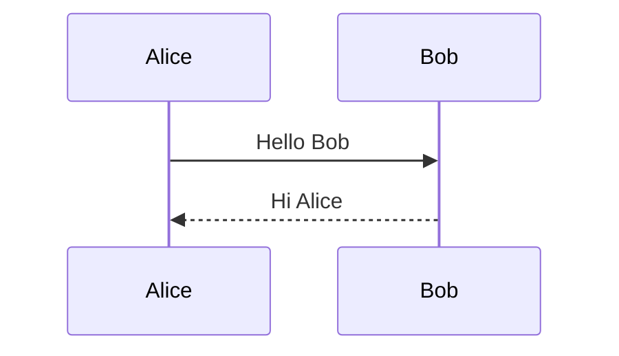
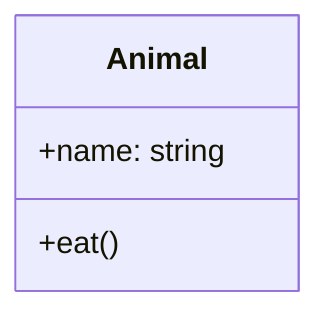
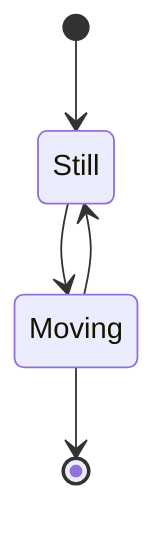
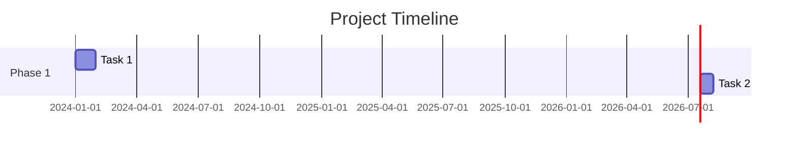

# Mermaid Diagram Usage Guide for PHP WordPress Course

## Overview
This guide explains how to properly use Mermaid diagrams in lesson HTML files for the PHP WordPress course.

## Quick Start

### For New Lesson Files
1. Use the `lesson-template.html` as your starting point
2. The template already includes:
   - Mermaid-specific CSS styles
   - Universal Mermaid fix script
   - Example diagram structure

### Adding a Mermaid Diagram

Always use this structure:

```html
<div class="mermaid-diagram">
    <pre class="mermaid">
flowchart LR
    A[Start] --> B[Process]
    B --> C[End]
    </pre>
</div>
```

## Important Notes

### 1. Wrapper Structure
- Always wrap diagrams in `<div class="mermaid-diagram">`
- Use `<pre class="mermaid">` for the diagram code
- This ensures proper styling and rendering

### 2. Decision Nodes
- For decision/diamond nodes, use square brackets with quotes:
  - ✅ Correct: `Decision["Question?"]`
  - ❌ Wrong: `Decision{Question?}`

### 3. Universal Fix Script
The `mermaid-universal-fix.js` script automatically:
- Loads Mermaid library (v9.4.3 for stability)
- Forces text to be black and visible
- Applies fixes multiple times to ensure visibility
- Works on any page with Mermaid diagrams

## Supported Diagram Types

### Flowchart


### Sequence Diagram


### Class Diagram


### State Diagram


### Gantt Chart


## Troubleshooting

### Text Not Visible
1. Ensure the universal fix script is included:
   ```html
   <script src="/assets/js/mermaid-universal-fix.js"></script>
   ```
2. Check that diagrams are wrapped properly
3. Clear browser cache and reload

### Page Breaks After Diagram
- This usually indicates a syntax error in the Mermaid code
- Check for unescaped special characters
- Use the decision node format: `["text"]` not `{text}`

### Diagram Not Rendering
1. Check browser console for errors
2. Verify Mermaid syntax is correct
3. Ensure the diagram is inside proper wrapper divs

## File Structure

```
/assets/
  /js/
    mermaid-universal-fix.js  # Universal fix script
  /css/
    main.css                   # Contains Mermaid styles

/lesson-template.html          # Template with Mermaid support
```

## For Existing Files

To add Mermaid support to an existing HTML file:

1. Add before `</body>`:
```html
<!-- Universal Mermaid Fix -->
<script src="/assets/js/mermaid-universal-fix.js"></script>
```

2. Optionally add styles in `<head>`:
```html
<style>
    .mermaid text {
        fill: #000000 !important;
        stroke: none !important;
    }
    .mermaid-diagram {
        margin: 2rem auto;
        padding: 2rem;
        background: #fff;
        border: 2px solid #e5e7eb;
        border-radius: 8px;
    }
</style>
```

## Best Practices

1. **Keep diagrams simple** - Complex diagrams can be hard to read
2. **Use consistent styling** - Stick to the flowchart types shown in examples
3. **Test on multiple browsers** - Ensure diagrams work everywhere
4. **Add alt text** - Consider accessibility by describing the diagram in text
5. **Use meaningful labels** - Make node text clear and concise

## Example: Complete Lesson Section with Mermaid

```html
<section>
    <h2>Website Planning Process</h2>
    <p>The planning process follows these key steps:</p>
    
    <div class="mermaid-diagram">
        <pre class="mermaid">
flowchart TD
    A[Define Goals] --> B[Research Audience]
    B --> C[Create Sitemap]
    C --> D[Design Wireframes]
    D --> E[Develop]
    E --> F[Test]
    F --> G[Launch]
        </pre>
    </div>
    
    <p>Each step builds upon the previous one...</p>
</section>
```

## Support

If you encounter issues with Mermaid diagrams:
1. Check this guide first
2. Verify your syntax using the Mermaid Live Editor: https://mermaid.live/
3. Ensure the universal fix script is loaded
4. Check browser console for errors

## Updates

Last Updated: January 2025
- Added universal fix script
- Updated to Mermaid v9.4.3 for stability
- Fixed text visibility issues
- Updated lesson template
